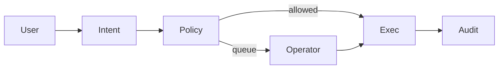

# FundPilot

Your money. Your rules. One operator.

## Run

```
npm install
npm run demo
npm run operator
npm run mcp
npm run web
```

See DEMO.md and SUBMISSION.md.

## Product

Understand intent, check policy firewall, act if allowed or queue for approval, audit why.
Not a chatbot. Binance-first.

## Architecture



## Packages

- packages/core — intent, policy, queue, audit, engine
- packages/binance — mock + Agentic Wallet interface
- packages/mcp-server — Track B MCP stdio tools
- apps/operator — dashboard + API on port 3847
- web — landing
- scripts/demo.ts — one-command demo

## Policy defaults

1. Reserve 1000 USD
2. Approval over 500 USD
3. Flag new recipients
4. Prioritize due today
5. Duplicate + unusual detection

Statuses: pending | approved | blocked | executed | delayed

## Tracks

- Track A: agent + operator
- Track B: MCP tools get_balances list_queue propose_payment approve_decision set_policy explain_decision execute_allowed list_audit


## Binance Agentic Wallet (baw)

Demo mode (`FUNDPILOT_MODE=demo`) uses `MockBinanceAdapter` — no secrets.

For real wallet auth + balances in the operator:

1. Install CLI: `npm i -g @binance/agentic-wallet`
2. Copy `.env.example` → `.env` and set `FUNDPILOT_MODE=baw`
3. Run `npm run operator` → open http://127.0.0.1:3847
4. Click **Connect Binance** (runs `baw auth signin --json`)
5. Confirm the **pairing code** in the Binance Wallet App (use `urlForWeb` verbatim)
6. Click **Verify** (`baw auth verify --qrCodeId … --json`, blocks up to ~5 min)
7. Balances load via `baw wallet balance --json`

Notes:
- Confirm connection with `baw wallet status --json` (`CONNECTED`), not only the App UI
- Tokens worth under $0.01 USD are hidden by the CLI
- Send/swap are stubbed in this release (auth + balances only)
- Landing `web/` stays pitch-only — connect lives in the operator

Skills: https://github.com/binance/binance-skills-hub

Operator: http://127.0.0.1:3847
Landing: http://127.0.0.1:8080
