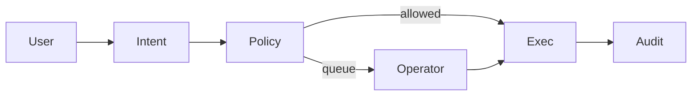

# FundPilot

Your money. Your rules. One operator.

## Run

```
npm install
npm run demo
npm run operator
npm run mcp
npm run web
```

See DEMO.md and SUBMISSION.md.

## Product

Understand intent, check policy firewall, act if allowed or queue for approval, audit why.
Not a chatbot. Binance-first.

## Architecture



## Packages

- packages/core — intent, policy, queue, audit, engine
- packages/binance — mock + Agentic Wallet interface
- packages/mcp-server — Track B MCP stdio tools
- apps/operator — dashboard + API on port 3847
- web — landing
- scripts/demo.ts — one-command demo

## Policy defaults

1. Reserve 1000 USD
2. Approval over 500 USD
3. Flag new recipients
4. Prioritize due today
5. Duplicate + unusual detection

Statuses: pending | approved | blocked | executed | delayed

## Tracks

- Track A: agent + operator
- Track B: MCP tools get_balances list_queue propose_payment approve_decision set_policy explain_decision execute_allowed list_audit

## Binance

Demo: MockBinanceAdapter. Real: @binance/agentic-wallet (baw). See packages/binance/src/baw.ts and .env.example.
Skills: https://github.com/binance/binance-skills-hub

Operator: http://127.0.0.1:3847
Landing: http://127.0.0.1:8080
